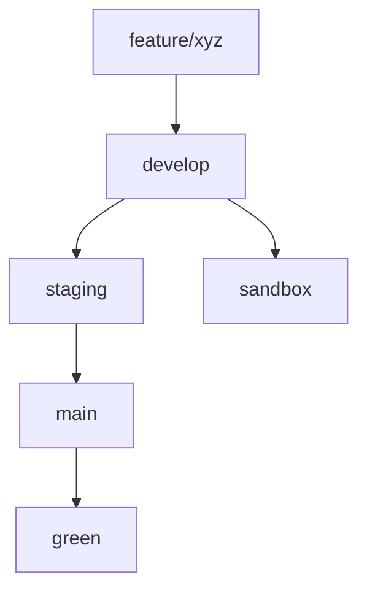

### Estructura recomendada de ramas

```
main (producción)
│
├── develop (integración principal)
│   │
│   ├── feature/* (ramas de desarrollo)
│   │
│   ├── staging (pre-producción - despliegue para pruebas finales)
│   │
│   ├── green (entorno de pruebas con datos clone de producción)
│   │
│   └── sandbox (entorno de pruebas sin datos reales)
```

### Detalle de cada rama:

1. **main (producción)**
   - Rama protegida
   - Solo acepta merges desde `staging`
   - Representa el código en producción
   - Deploy automático a producción

2. **develop (integración principal)**
   - Rama base para desarrollo
   - Todas las feature branches se mergean aquí primero
   - Entorno de desarrollo continuo

3. **staging (pre-producción)**
   - Rama para pruebas finales antes de producción
   - Recibe merges desde `develop` cuando se prepara un release
   - Deploy automático a entorno de staging
   - Configuración idéntica a producción (sin datos reales)

4. **green (pruebas con datos de producción)**
   - Rama especial para pruebas con datos reales (clonados/anonymizados)
   - Se crea desde `main` periódicamente
   - Nunca se mergea a otras ramas
   - Configuración especial para conectar a DB clone de producción

5. **sandbox (pruebas sin datos reales)**
   - Rama para pruebas de desarrollo
   - Se crea desde `develop`
   - Datos de prueba/mock
   - Entorno para validar nuevas features

### Workflow recomendado:



### Configuración específica por entorno:

1. **Variables de entorno**:
   - `.env.develop` - Desarrollo normal
   - `.env.staging` - Pre-producción
   - `.env.green` - Conexión a DB clone
   - `.env.sandbox` - Datos mock

2. **Políticas de merge**:
   - `main` ← `staging`: Solo con approval + tests
   - `staging` ← `develop`: Solo cuando se prepara release
   - `green`: Solo fast-forward desde `main`
   - `sandbox`: Merge libre desde `develop`

### Comandos útiles:

Para crear las ramas especiales:
```bash
# Desde develop
git checkout -b staging develop
git checkout -b sandbox develop

# Desde main (para green)
git checkout -b green main
```

### Ventajas de esta estructura:

1. **Aislamiento claro** entre entornos
2. **Protección de datos** reales
3. **Flujo visual** intuitivo
4. **Flexibilidad** para diferentes tipos de pruebas
5. **Prevención** de contaminación entre entornos

### Consideraciones adicionales:

1. Usa tags semánticos en `main` para releases
2. Implementa hooks de pre-commit/pre-push para validaciones
3. Considera namespaces para las ramas:
   - `env/staging`
   - `env/green`
   - `env/sandbox`

----

para mantener las ramas actualizadas y determinar de cuál clonar depende del propósito de cada rama. 
Aquí te detallo las mejores prácticas:

### Rama que **SIEMPRE debe estar actualizada**:

1. **`develop`** (rama de integración principal):
   - *Por qué*: Todas las features nuevas deben integrarse aquí primero
   - *Cómo mantenerla*:
     ```bash
     git checkout develop
     git pull origin develop
     ```
   - *Flujo*: Todas las ramas feature deben nacer de aquí y mergearse aquí

### Ramas para clonar según propósito:

| Propósito               | Rama origen       | Ejemplo de comando                     |
|-------------------------|-------------------|----------------------------------------|
| **Desarrollo normal**   | `develop`         | `git clone -b develop <repo-url>`      |
| **Pre-producción**      | `staging`         | `git clone -b staging <repo-url>`      |
| **Producción**          | `main`            | `git clone -b main <repo-url>`         |
| **Pruebas con datos reales** | `green`    | `git clone -b green <repo-url>`        |
| **Pruebas sin datos**   | `sandbox`         | `git clone -b sandbox <repo-url>`      |

### Reglas de actualización clave:

1. **`develop`**:
   - Se actualiza diariamente con merges de features
   - Nunca debe estar detrás de otras ramas

2. **`staging`**:
   - Se actualiza solo cuando preparas un release
   ```bash
   git checkout staging
   git merge develop --no-ff  # Merge explícito
   ```

3. **`main`**:
   - Solo se actualiza desde `staging` cuando hay release
   ```bash
   git checkout main
   git merge staging --no-ff
   git tag v1.0.0  # Ejemplo de tagging semántico
   ```

4. **`green`** (datos reales):
   - Se actualiza periódicamente desde `main` (ej. semanalmente)
   ```bash
   git checkout green
   git pull origin main --ff-only  # Solo fast-forward
   ```

5. **`sandbox`**:
   - Se actualiza frecuentemente desde `develop`
   ```bash
   git checkout sandbox
   git merge develop
   ```

### Buenas prácticas adicionales:

1. **Para nuevos desarrollos**:
   ```bash
   git checkout develop
   git pull origin develop
   git checkout -b feature/nueva-funcionalidad
   ```

2. **Políticas recomendadas**:
   - `main` y `staging` deben ser ramas protegidas
   - `green` debe tener commits solo por fast-forward
   - Usa `--no-ff` en merges a `staging` para mantener historia clara

3. **Diagrama de actualización**:
   ```
   feature/* → develop → staging → main → green
                      ↘ sandbox
   ```

Esta estructura garantiza que:
- El desarrollo siempre parte del código más actual (`develop`)
- Los entornos especializados tienen la base correcta
- La producción (`main`) solo recibe código validado en `staging`
- Las pruebas con datos reales (`green`) son fieles a producción